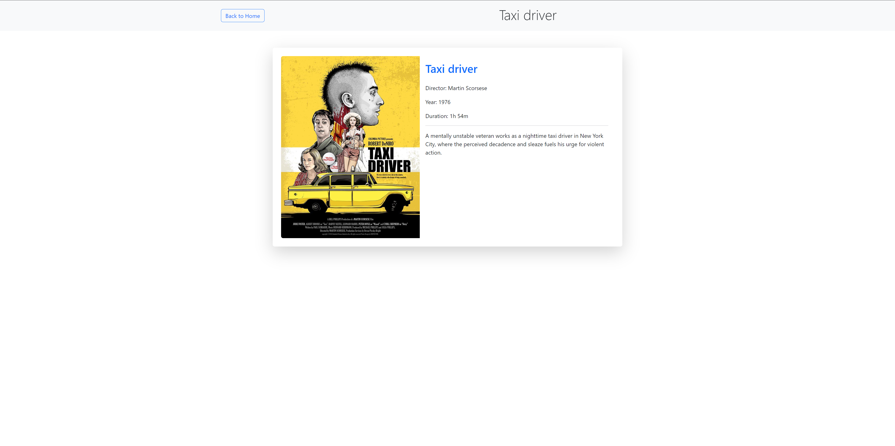

# Philippe's Movie Poster

**Philippe's Movie Poster** is an interactive web application that allows users to browse and search through a visual catalog of movies. This app includes advanced search features, pagination, and a dedicated detail page for each movie, offering an engaging experience for film enthusiasts.

## Table of Contents
1. [Features](#features)
2. [Screenshots](#screenshots) 
3. [Installation](#installation)
4. [Usage](#usage)
5. [Project Structure](#project-structure)
6. [Technologies Used](#technologies-used)
7. [Future Improvements](#future-improvements)
8. [Credits](#credits)

---

## Features

- **Movie Catalog**: Displays a collection of movies from a JSON file.
- **Search Functionality**: Filter movies by title, director, or release year.
- **Advanced Search**: Allows users to search for movies within a specific range of years.
- **Pagination**: Browse through pages to efficiently navigate the catalog.
- **Movie Detail Page**: Access complete information for each movie, including poster, synopsis, and additional metadata.
- **Smooth Animations**: Interactive elements with hover animations and transitions.

---

## Screenshots




--- 

## Installation

1. **Clone the repository**:
   ```bash
   git clone https://github.com/PhilippeInCode/Movie-Poster.git

2. Enter the project directory:
    cd philippes-movie-poster

3. Open index.html in your preferred browser to launch the application

---

## Usage

- Browse the Catalog: Open the app and scroll through the movie catalog to explore the collection.
- Search for Movies: Use the search bar at the top to filter by title, director, or release year.
- Advanced Search: Utilize advanced search options to filter movies by a range of years.
- Pagination: Click on the pagination controls at the bottom to navigate through pages.
- Movie Detail Page: Click on a movie to view detailed information, including poster, synopsis, and additional metadata.

---

## Project Structure

philippes-movie-poster/

├── index.html                       
├── styles/

   │   ├── styleIndex.css              
   │   ├── styleMovieDetails.css
   
├── scripts/

│   └── app.js

├── data/

│   └── movies.json

└── assets/

   └── images/


- index.html: The main HTML file that loads the app.
- styles/styleIndex.css: Contains CSS styles for the main catalog page.
- styles/styleMovieDetails.css: Contains CSS styles for the movie detail page.
- scripts/app.js: Handles JavaScript functions including search, pagination, and detail views.
- data/movies.json: The JSON file that contains the catalog of movies with their details.
- assets/images: Contains all images and posters used in the app.


---

## Technologies Used

- HTML5: Structure and layout of the app.
- CSS3: Styling and responsive design.
- JavaScript: Adds interactivity and dynamic elements.
- JSON: Stores movie data for easy access and manipulation.

---

## Future Improvements

- Backend Integration: Connect to a database or API to dynamically load movie data.
- User Authentication: Allow users to create accounts and save favorite movies.
- Enhanced Search Filters: Add filters for genre, ratings, and more.
- Reviews and Ratings: Enable users to leave reviews and rate movies.
- Accessibility Improvements: Improve accessibility for a more inclusive user experience.

---

## Credits

- Developer: Philippe
- Movie Data: Sourced from the films I have watched.
- Icons and Images: Various free image resources or licensed movie posters as appropriate.
